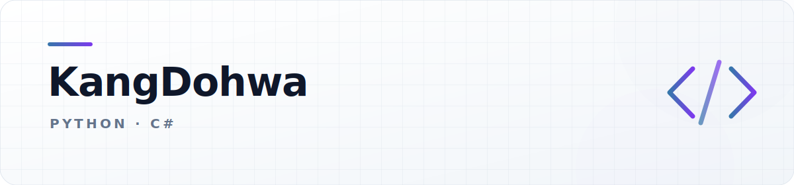

<picture>
  <source media="(prefers-color-scheme: dark)" srcset="./assets/profile-header-dark.svg">
  <source media="(prefers-color-scheme: light)" srcset="./assets/profile-header-light.svg">
  
</picture>

<!-- TODO(profile): 아래 한 줄 소개를 최종 문구로 교체합니다. -->
Python과 C#을 중심으로 만들고 배우고 있습니다.

## Main

## Tools & Platforms

<!--
대표 프로젝트가 정해지면 이 주석을 해제하고 내용을 교체합니다.

## Featured Projects

<table>
  <tr>
    <td width="33%"><strong>Project 01</strong> 프로젝트 설명과 링크</td>
    <td width="33%"><strong>Project 02</strong> 프로젝트 설명과 링크</td>
    <td width="33%"><strong>Project 03</strong> 프로젝트 설명과 링크</td>
  </tr>
</table>
-->

## Recent Activity

<!--START_SECTION:activity-->
_표시할 최근 공개 활동이 없습니다._
<!--END_SECTION:activity-->

## This Week I Spent My Time On

<!--START_SECTION:wakatime-->
_WakaTime API key를 등록하면 최근 7일 통계가 표시됩니다._
<!--END_SECTION:wakatime-->

## GitHub Stats

