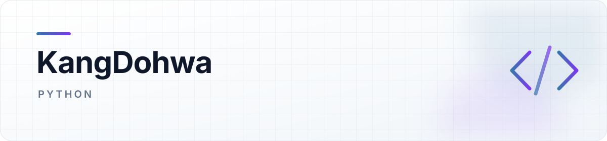
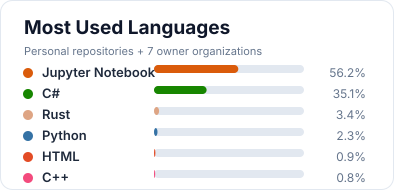
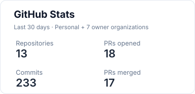

<div align="center">

<picture>
  <source media="(prefers-color-scheme: dark)" srcset="./assets/profile-header-dark.svg">
  <source media="(prefers-color-scheme: light)" srcset="./assets/profile-header-light.svg">
  
</picture>

I'm learning Python, machine learning, and NLP by building with AI tools, then reviewing, testing, and debugging the results.

</div>

## Learning & Building


## Have Used


## Tools & Platforms


<!--
대표 프로젝트가 정해지면 이 주석을 해제하고 내용을 교체합니다.

## Featured Projects

<table>
  <tr>
    <td width="33%"><strong>Project 01</strong><br>프로젝트 설명과 링크</td>
    <td width="33%"><strong>Project 02</strong><br>프로젝트 설명과 링크</td>
    <td width="33%"><strong>Project 03</strong><br>프로젝트 설명과 링크</td>
  </tr>
</table>
-->

## Recent Activity

<!--START_SECTION:activity-->
- `2026-08-05` Pushed to `main` in [`KangDohwa/hermes-session-lens`](https://github.com/KangDohwa/hermes-session-lens) ([latest commit](https://github.com/KangDohwa/hermes-session-lens/commit/ed83631fb95c9262427f7b8f656bcc28acb06ab8))
- `2026-08-05` Made [`KangDohwa/hermes-session-lens`](https://github.com/KangDohwa/hermes-session-lens) public
- `2026-08-05` Pushed to `main` in [`KangDohwa/dohwa-hermes-stack`](https://github.com/KangDohwa/dohwa-hermes-stack) ([latest commit](https://github.com/KangDohwa/dohwa-hermes-stack/commit/1706cb875f8fdb5c760fc97c0bc1b5e43f900e98))
- `2026-08-04` Pushed to `main` in [`KangDohwa/ponytail`](https://github.com/KangDohwa/ponytail) ([latest commit](https://github.com/KangDohwa/ponytail/commit/b4ed6f278c36adc18ef8a3359c6f5cd8d02697bd))
- `2026-08-01` Made [`KangDohwa/hermes-runtime-clock`](https://github.com/KangDohwa/hermes-runtime-clock) public
<!--END_SECTION:activity-->

## This Week I Spent My Time On

<!--START_SECTION:wakatime-->
```text
Total: 22 hrs 59 mins

Other        9 hrs 46 mins      █████████░░░░░░░░░░░   42.54 %
Markdown     3 hrs 8 mins       ███░░░░░░░░░░░░░░░░░   13.67 %
TypeScript   3 hrs 5 mins       ███░░░░░░░░░░░░░░░░░   13.43 %
Python       2 hrs 56 mins      ███░░░░░░░░░░░░░░░░░   12.77 %
Bash         2 hrs 35 mins      ██░░░░░░░░░░░░░░░░░░   11.29 %
```
<!--END_SECTION:wakatime-->

## GitHub Stats

<div align="center">




</div>
