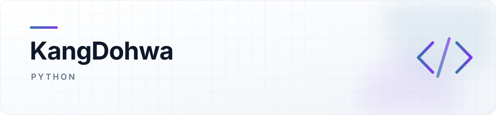
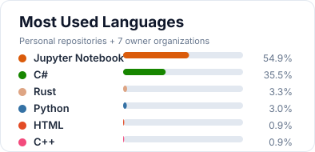
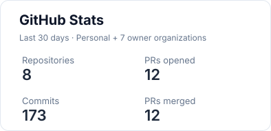

<picture>
  <source media="(prefers-color-scheme: dark)" srcset="./assets/profile-header-dark.svg">
  <source media="(prefers-color-scheme: light)" srcset="./assets/profile-header-light.svg">
  
</picture>

Learning Python, machine learning, and NLP through projects and AI-assisted development.

## Featured Projects

### [Officelings](https://github.com/KangDohwa/Officelings)

A Windows pixel office that visualizes local Codex, Claude Code, and Antigravity sessions. Built with C# and WPF, with flat and isometric views.

[Source](https://github.com/KangDohwa/Officelings) · [Releases](https://github.com/KangDohwa/Officelings/releases)

### [Maestroid](https://github.com/KangDohwa/Maestroid)

A maintained fork of [AionUi](https://github.com/iOfficeAI/AionUi), where I explore workflows for AI coding agents.

[Source](https://github.com/KangDohwa/Maestroid) · [Changes from upstream](https://github.com/iOfficeAI/AionUi/compare/main...KangDohwa:Maestroid:main)

## Stack & Tools

**Learning & building**

**Have used**

**Development**

**Cloud & platforms**

## Recent Activity

<!--START_SECTION:activity-->
- `2026-10-08` Released [Officelings 0.1.0](https://github.com/KangDohwa/Officelings/releases/tag/v0.1.0) from [`KangDohwa/Officelings`](https://github.com/KangDohwa/Officelings)
- `2026-10-05` Pushed to `main` in [`KangDohwa/Maestroid`](https://github.com/KangDohwa/Maestroid) ([latest commit](https://github.com/KangDohwa/Maestroid/commit/954f6b8ad4ab59a52ccc72b5d180db9058820452))
- `2026-09-29` Pushed to `main` in [`KangDohwa/pixel-agents`](https://github.com/KangDohwa/pixel-agents) ([latest commit](https://github.com/KangDohwa/pixel-agents/commit/56810b57d4bb001d5ca686f22245e60287a9db70))

Updated: 2026-10-10 UTC · Public activity in personal repositories.
<!--END_SECTION:activity-->

## GitHub Stats

How these numbers are counted

- **Scope:** personal repositories and repositories in organizations where I am an Owner. Accessible private repositories contribute aggregate values only.
- **Forks:** excluded by default; the maintained `KangDohwa/Maestroid` fork is explicitly included.
- **Repositories:** distinct repositories with qualifying commit, opened PR, or merged PR activity in the last 30 days.
- **Commits:** commits recognized by GitHub profile contributions, rather than every commit on every branch.
- **PRs opened / merged:** PRs I authored that were opened or merged during the same rolling 30-day UTC window.
- **Repository languages:** current repository contents measured by bytes, including inherited code in selected forks. These percentages do not represent coding time or proficiency.
- **Updates:** each section retains its last successful result and update date if its data source fails.

